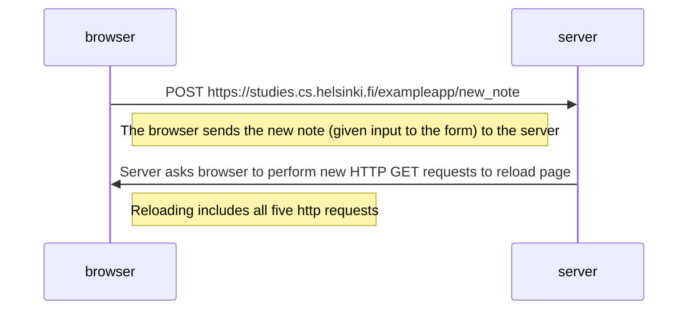

```mermaid
sequenceDiagram
    participant browser
    participant server
    browser->>server: POST https://studies.cs.helsinki.fi/exampleapp/new_note
    Note right of browser: The browser sends the new note (given input to the form) to the server
    server->>browser: Server asks browser to perform new HTTP GET requests to reload page
    Note right of browser: Reloading includes all five http requests
```
