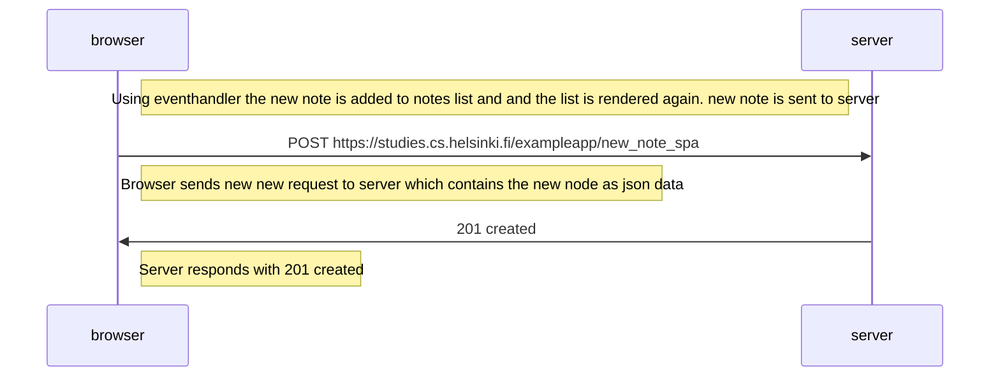

```mermaid
sequenceDiagram
    participant browser
    participant server
    note right of browser: Using eventhandler the new note is added to notes list and and the list is rendered again. new note is sent to server
    browser->>server: POST https://studies.cs.helsinki.fi/exampleapp/new_note_spa
    Note right of browser: Browser sends new new request to server which contains the new node as json data
    server->>browser: 201 created
    Note right of browser: Server responds with 201 created
```
